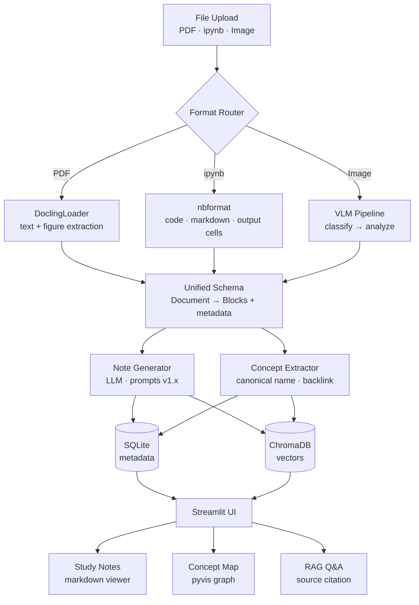

# CatchUp v2

**You study. CatchUp connects.**

---

## Problem Statement

Dropping a single document into GPT works fine for summarization. The problem is the **forest**: when you have a PDF, a notebook, and a few screenshots all covering related concepts, no tool connects what lives across them. You get isolated answers, not a unified understanding.

CatchUp ingests unstructured study materials — PDF, Jupyter notebooks, images — parses them through a multi-format pipeline, generates structured study notes, and automatically links shared concepts across documents. The result is searchable, query-able knowledge that grows as you add more material.

---

## Architecture

**Per-stage technology:**

| Stage | Technology |
|---|---|
| PDF parsing | DoclingLoader (Docling) |
| Notebook parsing | nbformat |
| Image classification + analysis | VLM API (OpenAI / Google / Anthropic) |
| Note generation | LLM + versioned prompts (`prompts/note_generation.py`) |
| Concept extraction | LLM + canonical name normalization |
| Vector search | LangChain RetrievalChain + ChromaDB |
| Metadata storage | SQLite |
| Observability | JSONL logging → Langfuse (planned) |
| UI | Streamlit + pyvis |

---

## Key Features

### Parsing & Input
- ✅ PDF parser — DoclingLoader, text + figure block extraction
- ✅ ipynb parser — nbformat, separates code / markdown / output cells
- ✅ Storage layer — SQLite (metadata) + ChromaDB (vectors) + JSONL API logging
- ✅ VLM client wrapper — 10 models across OpenAI, Google, and Anthropic; unified interface with per-call cost tracking
- ✅ VLM prompts v1.1 — type-specific prompts: `vlm_code`, `vlm_diagram`, `vlm_text`; structured JSON output with confidence + error fields
- ✅ Image parser — VLM-based 5-class classification (code / diagram / text / equation / other) + type-specific routing

### LLM Pipeline
- ✅ Note generation prompts v1.4 — study note prompt with versioned iteration history (v1.0 → v1.4.1); per-version quality delta recorded in `prompts/VERSION_LOG.md`
- ⬜ Note generation pipeline — end-to-end document → markdown study note
- ⬜ Concept extraction + cross-document backlink
- ⬜ RAG Q&A with source citation (block id / page number)

### Evaluation
- ⬜ Evaluation framework — golden set (15–25 docs) + Before/After comparison (raw doc → LLM vs CatchUp → LLM)
- ⬜ VLM comparison experiment — 12 models, 8-axis analysis (details in [VLM Comparison](#vlm-comparison))
- ⬜ Edge case handling — taxonomy + fallback strategy (empty images, mixed-type, prompt injection, low-res)

### Operations & UI
- ⬜ Streamlit UI — upload, note viewer, concept map, RAG Q&A, keyword + vector search
- ⬜ Langfuse observability — stage-level latency / token / cost dashboard
- ⬜ Deployment — Streamlit Cloud or HuggingFace Spaces

---

## Tech Stack

| Category | Technology |
|---|---|
| Frontend | Streamlit |
| VLM — OpenAI (bootcamp-funded) | GPT-4o-mini, GPT-4.1 nano, GPT-4.1 mini, GPT-5 nano, GPT-5 mini |
| VLM — Google | Gemini 3.0 Flash, Gemini 3.1 Pro |
| VLM — Anthropic | Claude Haiku 4.5, Claude Sonnet 4.6 |
| VLM — Open-source | Qwen2-VL 7B INT4 (must), LLaVA-1.6 7B (should), PaliGemma (stretch) via RunPod GPU |
| LLM | Same model pool as VLM — note generation, concept extraction, evaluation |
| Document parsing | DoclingLoader (PDF), nbformat (ipynb) |
| RAG | LangChain RetrievalChain + ChromaDB |
| Database | SQLite (metadata) + ChromaDB (vectors) |
| Visualization | pyvis / streamlit-agraph |
| Observability | Langfuse |
| Deployment | Streamlit Cloud or HuggingFace Spaces |
| GPU (open-source VLM) | RunPod |

---

## VLM Comparison

A systematic comparison of 12 VLM models on IT study material parsing is planned for Week 3.

**Models:** 9 commercial APIs (OpenAI × 5, Google × 2, Anthropic × 2) + open-source Qwen2-VL 7B (required), LLaVA-1.6 7B and PaliGemma if time permits.

**8-axis analysis:**
1. Cross-provider comparison — same price tier across OpenAI / Google / Anthropic
2. Price tier comparison — cost range spans ~150×; quality delta measured
3. Commercial vs. open-source — cost / privacy / latency trade-offs
4. **Reasoning vs. non-reasoning** — GPT-5 (CoT) vs. GPT-4.1 on document layout parsing (no existing benchmark covers this)
5. **Generational jump** — GPT-4o-mini → GPT-4.1 → GPT-5 quality delta
6. **Nano vs. mini gap** — within the same generation, 5–8× cost difference vs. quality difference
7. Router classification accuracy — image-type precision/recall including edge cases
8. Resolution optimization — original / 1600px / 1024px / 512px × grayscale; cost and quality impact quantified

**Evaluation metrics:** NED + AST parse success rate (code), LLM-as-judge 3-axis rubric (diagrams), ANLS + reading order consistency (text), Kruskal-Wallis test for cross-model significance.

**Gap vs. existing benchmarks:** DocVQA and OCRBench measure short-answer extraction. This experiment targets markdown structure preservation, diagram-to-text transformation, and Korean/English mixed IT domain — areas no public benchmark currently covers.

*Results coming soon.*

---

## Project Context

**Portfolio purpose:** Demonstrating an LLM Engineer pivot from a Computer Vision background.

- **VLM as leverage:** CV expertise in visual data understanding directly applies to the input layer — image classification, document layout interpretation, multi-modal parsing.
- **LLM pipeline as proof:** The core competency being demonstrated is pipeline design, prompt engineering (versioned, evaluated), RAG architecture, evaluation framework, and operational observability — not just calling an API.
- **Why this problem:** The gap between "GPT can summarize one document" and "a system that connects knowledge across documents" is an engineering problem, not just a model problem. CatchUp is the engineering argument.

---

## Development Status

| Period | Focus | Weight | Status |
|---|---|---|---|
| Week 1 (first half) | Multi-format parsing · unified schema · DB setup | 50% | ✅ Done |
| Week 1 (second half) | VLM/LLM note generation · image-type prompts | 50% | 🔧 In Progress |
| Week 2 (first half) | RAG Q&A · evaluation framework · error handling | 30% | ⬜ Upcoming |
| Week 2 (second half) | Concept extraction · backlink · Streamlit UI | 20% | ⬜ Upcoming |
| Week 3 | VLM comparison experiment · observability · deployment · README | Wrap-up | ⬜ Upcoming |

**Current position:** Week 1 second half — note generation pipeline and demo UI.
